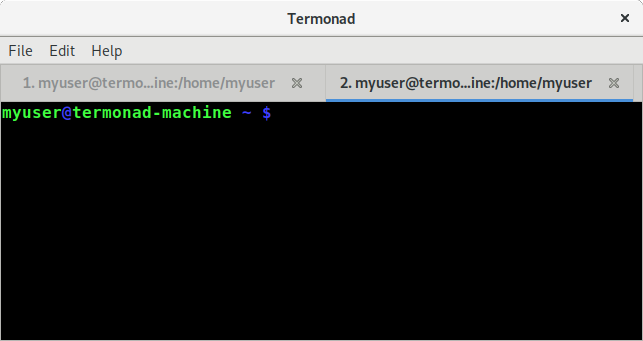

Termonad
=========

[](http://travis-ci.org/cdepillabout/termonad)
[](https://hackage.haskell.org/package/termonad)
[](http://stackage.org/lts/package/termonad)
[](http://stackage.org/nightly/package/termonad)
[](./LICENSE)
[](https://gitter.im/termonad/Lobby?utm_source=badge&utm_medium=badge&utm_campaign=pr-badge&utm_content=badge)
[](https://webchat.freenode.net/)

Termonad is a terminal emulator configurable in Haskell.  It is extremely
customizable and provides hooks to modify the default behavior.  It can be
thought of as the "XMonad" of terminal emulators.



<!-- markdown-toc start - Don't edit this section. Run M-x markdown-toc-refresh-toc -->
**Table of Contents**

- [Termonad](#termonad)
    - [Installation](#installation)
        - [Arch Linux](#arch-linux)
        - [Ubuntu / Debian](#ubuntu--debian)
        - [Nix](#nix)
        - [Mac OS X](#mac-os-x)
            - [Installing with just `stack`](#installing-with-just-stack)
            - [Installing with just `nix`](#installing-with-just-nix)
            - [Installing with `stack` using `nix`](#installing-with-stack-using-nix)
        - [Windows](#windows)
    - [How to use Termonad](#how-to-use-termonad)
        - [Default Keybindings](#default-keybindings)
        - [Configuring Termonad](#configuring-termonad)
        - [Compiling Local Settings](#compiling-local-settings)
            - [Running with `stack`](#running-with-stack)
            - [Running with `nix`](#running-with-nix)
    - [Goals](#goals)
    - [Where to get help](#where-to-get-help)
    - [Contributions](#contributions)
    - [Maintainers](#maintainers)

<!-- markdown-toc end -->

## Installation

Termonad can be installed on any system as long as the necessary GTK libraries
are available.  The following are instructions for installing Termonad on a few
different distributions and systems.  If the given steps don't work for you, or
you want to add instructions for an additional system, please send a pull
request.

The following steps use the
[`stack`](https://docs.haskellstack.org/en/stable/README/) build tool to build
Termonad, but [`cabal`](https://www.haskell.org/cabal/) can be used as well. Steps for
installing `stack` can be found on
[this page](https://docs.haskellstack.org/en/stable/install_and_upgrade/).


### Arch Linux

First, you must install the required GTK system libraries:

```sh
$ pacman -S vte3
```

In order to install Termonad, clone this repository and run `stack install`.
This will install the `termonad` binary to `~/.local/bin/`:

```sh
$ git clone https://github.com/cdepillabout/termonad
$ cd termonad/
$ stack install
```

### Ubuntu / Debian

First, you must install the required GTK system libraries:

```sh
$ apt-get install gobject-introspection libgirepository1.0-dev libgtk-3-dev libvte-2.91-dev
```

In order to install Termonad, clone this repository and run `stack install`.
This will install the `termonad` binary to `~/.local/bin/`:

```sh
$ git clone https://github.com/cdepillabout/termonad
$ cd termonad/
$ stack install
```

### Nix

If you have `nix` installed, you should be able to use it to build Termonad.
This means that it will work on NixOS, or with `nix` on another distro.  There
are two different ways to use `nix` to build Termonad:

The first is using `stack`.  The following commands install `stack` for your
user, clone this repository, and install the `termonad` binary to `~/.local/bin/`:

```sh
$ nix-env -i stack
$ git clone https://github.com/cdepillabout/termonad
$ cd termonad/
$ stack --nix install
```

The second is using the normal `nix-build` machinery.  The following commands
clone this repository and build the `termonad` binary at `./result/bin/`:

```sh
$ git clone https://github.com/cdepillabout/termonad
$ cd termonad/
$ nix-build
```

### Mac OS X

Building and installing Termonad on Mac OS X should be possible with any of the following three methods:

-   Install the required system libraries (like GTK and VTE) by hand, then use
    `stack` to build Termonad.

    This is probably the easiest method.  You don't have to understand anything
    about `nix`.  However, it is slightly annoying to have to install GTK and
    VTE by hand.

-   Use `nix` to install both the required system libraries and Termonad itself.

    If you are a nix user and want an easy way to install Termonad, this
    is the recommended method.

-   Use `nix` to install install the required system libraries, and `stack` to
    build Termonad.

    If you are a nix user, but want to use `stack` to actually do development
    on Termonad, using `stack` may be easier than using `cabal`.

The following sections describe each method.

#### Installing with just `stack`

(*currently no instructions available.  please send a PR adding instructions if you get termonad to build using this method.*)

#### Installing with just `nix`

(*currently no instructions available.  please send a PR adding instructions if you get termonad to build using this method.*)

#### Installing with `stack` using `nix`

`stack` can be used in conjunction with `nix` to install Termonad.  `nix` will
handle installing system dependencies (like GTK and VTE), while `stack` will
handle compiling and installing Haskell packages.

You must have `nix` [installed](https://nixos.org/nix/download.html).

You will also need `stack` installed.  You can do that with the following command:

```sh
$ nix-env -i stack
```

After `stack` is installed, you will need to clone Termonad and build it:

```
$ git clone https://github.com/cdepillabout/termonad
$ cd termonad/
$ stack --nix install
```

This will install the `termonad` binary to `~/.local/bin/`.

### Windows

(*currently no instructions available.  please send a PR adding instructions if you get termonad to build.*)

## How to use Termonad

Termonad is similar to XMonad. The above steps will install a `termonad` binary
somewhere on your system. If you have installed Termonad using `stack`, the
`termonad` binary will be in `~/.local/bin/`. This binary is a version of
Termonad configured with default settings. You can try running it to get an idea
of what Termonad is like:

```sh
$ ~/.local/bin/termonad
```

The following section describes the default keybindings.

If you would like to configure Termonad with your own settings, first you will
need to create a Haskell file called `~/.config/termonad/termonad.hs`. A following
section gives an example configuration file.

If this file exists, when the `~/.local/bin/termonad` binary launches, it will
try to compile it. If it succeeds, it will create a separate binary file called
something like `~/.cache/termonad/termonad-linux-x86_64`. This binary file can
be thought of as your own personal Termonad, configured with all your own
settings.

When you run `~/.local/bin/termonad`, it will re-exec
`~/.cache/termonad/termonad-linux-x86_64` if it exists.

However, there is one difficulty with this setup. In order for the
`~/.local/bin/termonad` binary to be able to compile your
`~/.config/termonad/termonad.hs` file, it needs to know where GHC is, as well as
where all your Haskell packages live. This presents some difficulties that will
be discussed in a following section.

### Default Keybindings

Termonad provides the following default key bindings.

| Keybinding | Action |
|------------|--------|
| <kbd>Ctrl</kbd> <kbd>Shift</kbd> <kbd>t</kbd> | Open new tab. |
| <kbd>Ctrl</kbd> <kbd>Shift</kbd> <kbd>w</kbd> | Close tab. |
| <kbd>Alt</kbd> <kbd>(number key)</kbd> | Switch to tab `number`.  For example, <kbd>Alt</kbd> <kbd>2</kbd> switches to tab 2. |

### Configuring Termonad

The following is an example Termonad configuration file. You should save this to
`~/.config/termonad/termonad.hs`. You can find more information on the available
configuration options within the
[`Termonad.Config`](https://hackage.haskell.org/package/termonad/docs/Termonad-Config.html)
module.

```haskell
{-# LANGUAGE OverloadedStrings #-}

module Main where

import Data.Colour.SRGB (Colour, sRGB24)
import Termonad.App (defaultMain)
import Termonad.Config
  ( FontConfig, FontSize(FontSizePoints), Option(Set)
  , ShowScrollbar(ShowScrollbarAlways), defaultConfigOptions, defaultFontConfig
  , defaultTMConfig, fontConfig, fontFamily, fontSize, options, showScrollbar
  )
import Termonad.Config.Colour
  (ColourConfig, addColourExtension, createColourExtension, cursorBgColour
  , defaultColourConfig
  )

-- | This sets the color of the cursor in the terminal.
--
-- This uses the "Data.Colour" module to define a dark-red color.
-- There are many default colors defined in "Data.Colour.Names".
cursBgColor :: Colour Double
cursBgColor = sRGB24 204 0 0

-- | This sets the colors used for the terminal.  We only specify the background
-- color of the cursor.
colConf :: ColourConfig (Colour Double)
colConf =
  defaultColourConfig
    { cursorBgColour = Set cursBgColor
    }

-- | This defines the font for the terminal.
fontConf :: FontConfig
fontConf =
  defaultFontConfig
    { fontFamily = "DejaVu Sans Mono"
    , fontSize = FontSizePoints 13
    }

main :: IO ()
main = do
  colExt <- createColourExtension colConf
  let termonadConf =
        defaultTMConfig
          { options =
              defaultConfigOptions
                { fontConfig = fontConf
                  -- Make sure the scrollbar is always visible.
                , showScrollbar = ShowScrollbarAlways
                }
          }
        `addColourExtension` colExt
  defaultMain termonadConf
```

### Compiling Local Settings

If you launch Termonad by calling `~/.local/bin/termonad`, it will try to
compile the `~/.config/termonad/termonad.hs` file if it exists.  The problem is
that `~/.local/bin/termonad` needs to be able to see GHC and the required
Haskell libraries to be able to compile `~/.config/termonad/termonad.hs`.

There are a couple solutions to this problem, listed in the sections below.

(These steps are definitely confusing. I would love to figure out a better
way to do this.  Please submit an issue or PR if you have a good idea about
how to fix this.)

#### Running with `stack`

If you originally compiled Termonad with `stack`, you can use `stack` to
execute Termonad.  First, you must change to the directory with the Termonad
source code.  From there, you can run `stack exec`:

```sh
$ cd termonad/  # change to the termonad source code directory
$ stack exec -- termonad
```

`stack` will pick up the correct GHC version and libraries from the
`stack.yaml` and `termonad.cabal` file.  `termonad` will be run in an
environment with GHC available.  `termonad` will use this GHC and libraries to
compile your `~/.config/termonad/termonad.hs` file.  It if succeeds, it should
create a `~/.cache/termonad/termonad-linux-x86_64` binary.

If you need extra Haskell libraries available when compiling your
`~/.config/termonad/termonad.hs` file, you can specify them to `stack exec`:

```sh
$ stack exec --package lens --package conduit -- termonad
```

The problem with this is that `stack exec` changes quite a few of your
environment variables.  It is not recommended to actually run Termonad from
within `stack exec`.  After you run `stack exec -- termonad` and let it
recompile your `~/.config/termonad/termonad.hs` file, exit Termonad.
Re-run Termonad by calling it directly.  Termonad will notice that
`~/.config/termonad/termonad.hs` hasn't changed since
`~/.cache/termonad/termonad-linux-x86_64` has been recompiled, so it will
directly execute `~/.cache/termonad/termonad-linux-x86_64`.

#### Running with `nix`

Building Termonad with `nix` (by running `nix-build` in the top
directory) sets it up so that Termonad can see GHC.  Termonad should be able
to compile the `~/.config/termonad/termonad.hs` file by default.

If you're interested in how this works, or want to change which Haskell
packages are available from your `~/.config/termonad/termonad.hs` file, please
see the documentation in the
[`.nix-helpers/termonad-with-packages.nix`](./.nix-helpers/termonad-with-packages.nix)
file.

## Goals

Termonad has the following goals:

* fully configurable in Haskell

  There are already
  [many](https://gnometerminator.blogspot.com/p/introduction.html)
  [good](https://www.enlightenment.org/about-terminology.md)
  [terminal](http://software.schmorp.de/pkg/rxvt-unicode.html)
  [emulators](https://launchpad.net/sakura).  However, there are no terminal
  emulators fully configurable in Haskell.  Termonad fills this niche.

* flexible

  Most people only need a terminal emulator that lets you change the font-size,
  cursor color, etc.  They don't need tons of configuration options.  Termonad
  should be for people that like lots of configuration options.  Termonad
  should provide many hooks to allow the user full control over its behavior.

* stable

  Termonad should be able to be used everyday as your main terminal
  emulator.  It should not crash for any reason.  If you experience a crash,
  please file an issue or a pull request!

* good documentation

  The [documentation](https://hackage.haskell.org/package/termonad) for
  Termonad on Hackage should be good.  You shouldn't have to guess at what
  certain data types or functions do.  If you have a hard time understanding
  anything in the documentation, please submit an issue or PR.

## Where to get help

If you find a bug in Termonad, please either
[send a PR](https://github.com/cdepillabout/termonad/pulls) fixing it or create
an [issue](https://github.com/cdepillabout/termonad/issues) explaining it.

If you just need help with configuring Termonad, you can either join the
[Gitter room](https://gitter.im/termonad/Lobby) or
[#termonad on irc.freenode.net](https://webchat.freenode.net/).

## Contributions

Contributions are highly appreciated.  Termonad is currently missing many
helpful configuration options and behavior hooks.  If there is something you
would like to add, please submit an issue or PR.

## Maintainers

- [cdepillabout](https://github.com/cdepillabout)
- [LSLeary](https://github.com/LSLeary)
